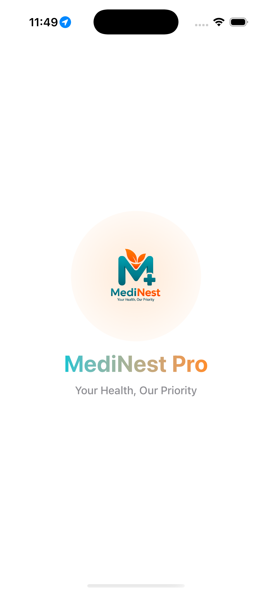
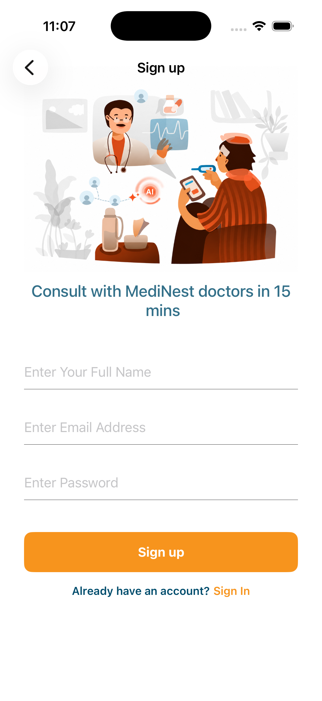
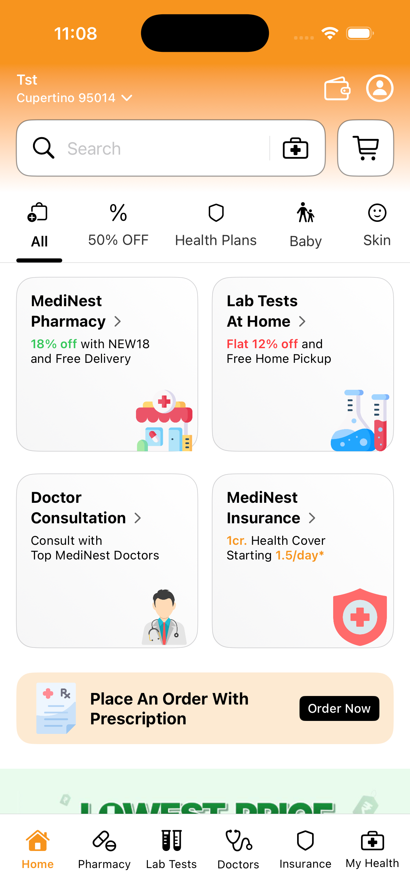
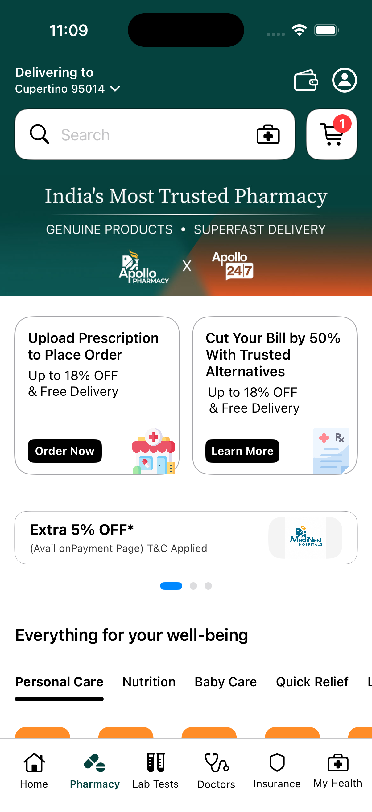
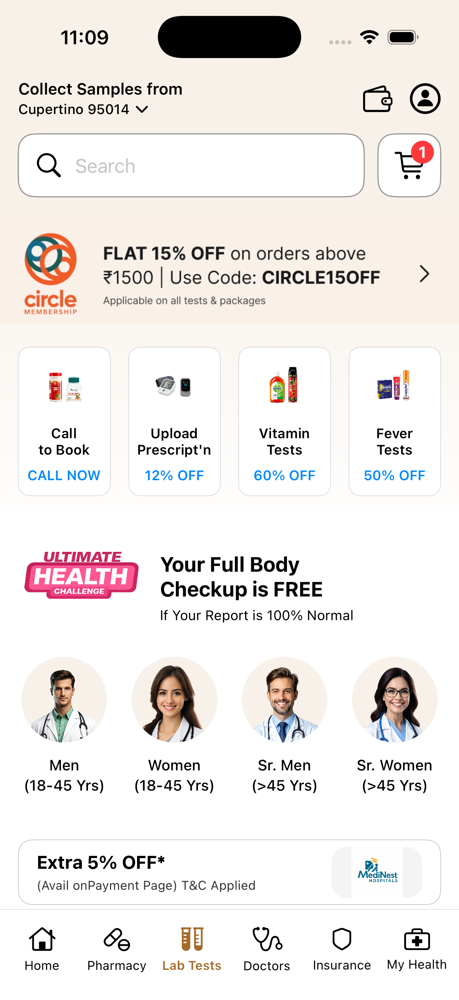
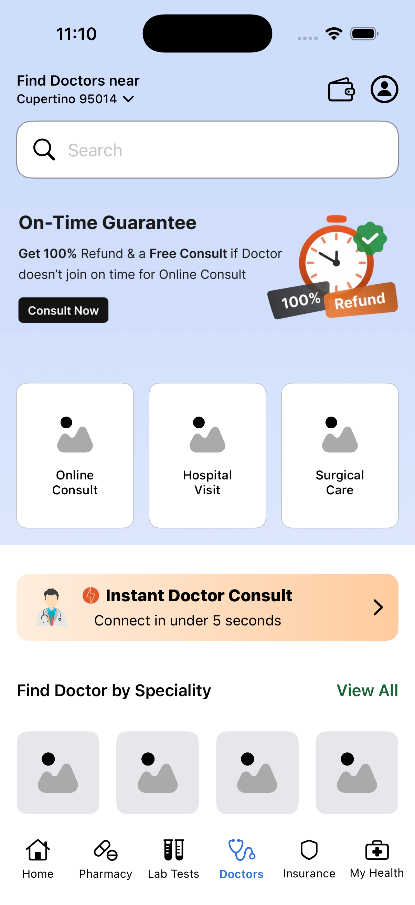
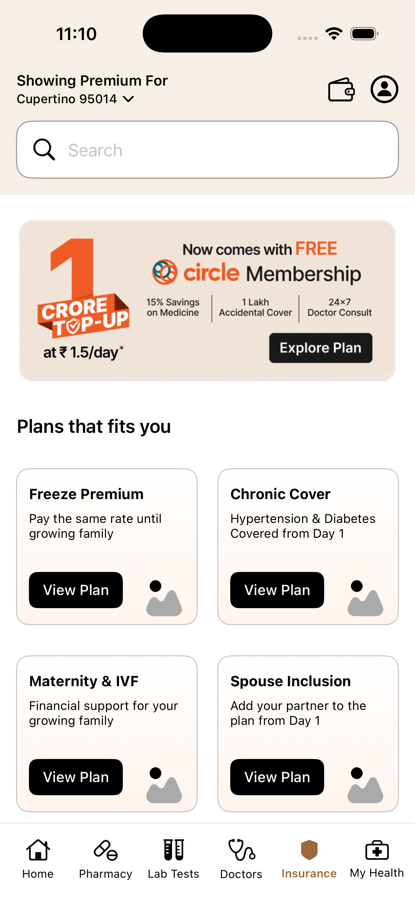
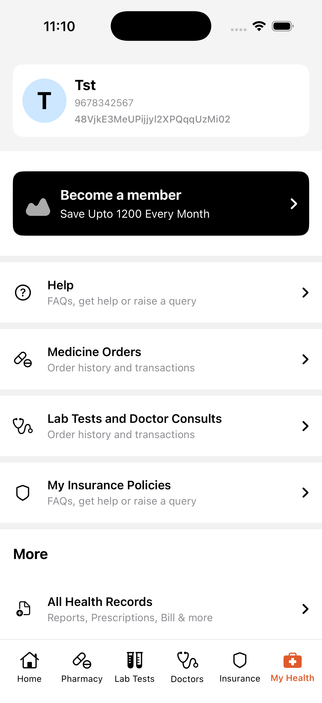

# MediNest-Pro

MediNest is an iOS portfolio project inspired by the Apollo 24|7 app experience. Built with **SwiftUI**, it explores modern healthcare-app UI development, including navigation, authentication, user sessions, state management, and reusable components.

The project focuses on creating responsive, reusable SwiftUI interfaces while maintaining a clean, scalable architecture using **MVVM**.

---

## 📱 Overview

MediNest Pro offers a streamlined healthcare-app experience where users can:

- Register and sign in
- Manage their user session
- Browse products
- View product details
- Add products to the cart
- View their current location
- Navigate through the application using a custom Tab Bar
- Use responsive and reusable SwiftUI components

The application currently uses **local dummy data** for product information.

---

# 📸 Screenshots

| Splash | Register |
|--------|------|
|  |  |

| Home | Pharmacy |
|---------|--------|
|  |  |

| Lab | Doctor |
|---------|---------|
|  |  |

| Insurance | Profile |
|---------|---------|
|  |  |

---

# 🚀 Highlights

- Built using **SwiftUI**
- Followed **MVVM architecture**
- Built responsive UI for different iPhone screen sizes
- Created reusable and custom SwiftUI views
- Implemented a custom Tab Bar
- Implemented custom navigation management
- Added Firebase Authentication
- Implemented user session management
- Added state management using SwiftUI property wrappers
- Integrated Core Location for current location
- Used local dummy data for product information
- Added animated splash screen
- Implemented product browsing and cart functionality

---

# ✨ Features

### 🔐 Authentication

- User registration
- User login
- Firebase Authentication
- Session handling
- Logout functionality

### 🏠 Product Browsing

- Product listing
- Product details
- Product information display
- Local dummy product data

### 🛒 Cart

- Add products to cart
- Manage cart items
- Update product quantity
- View selected products

### 📍 Location

- Request location permission
- Get the user's current location
- Display location-related information

### 🎨 UI & Navigation

- SwiftUI-based interface
- Responsive layouts
- Custom reusable views
- Custom Tab Bar
- Custom navigation manager
- Animated splash screen
- Consistent UI components
- Multiple screen navigation

### 🔄 State & Session Management

- Manage application state using SwiftUI
- Handle authentication state
- Maintain user sessions
- Update UI based on state changes

---

# 🛠 Tech Stack

### Language

- Swift

### UI

- SwiftUI
- Custom SwiftUI Views
- Responsive Layouts

### Architecture

- MVVM (Model-View-ViewModel)

### Authentication

- Firebase Authentication

### Location

- Core Location

### Data

- Local Dummy Data

### Development

- Xcode
- Git
- GitHub

---

# 🏛 Architecture

The project follows the **MVVM (Model-View-ViewModel)** architecture to separate UI code from application logic.

text
                SwiftUI Views
                     │
                     ▼
                ViewModel
                     │
                     ▼
                  Model
                     │
                     ▼
          Firebase / Local Data

---

# 🚀 Getting Started

### Clone the repository

bash
https://github.com/Md-owais-07/SwiftGPT.git

### Open the project

Open the project using the latest version of **Xcode**.

### Build & Run

Run the app.

---

# 👨‍💻 Author

**Mohammad Owais**

- GitHub: https://github.com/Md-owais-07
- LinkedIn: https://www.linkedin.com/in/mdowais1/

---

# 📄 License

This project is licensed under the MIT License.

---

## ⭐ Support

If you found this project helpful, consider giving it a **⭐ Star** on GitHub.
